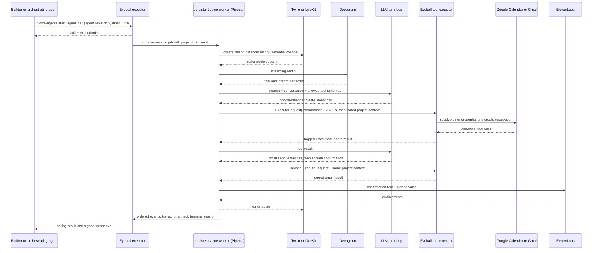

# RFC 002: Voice Agents as a First-Class Resource

- Status: Draft for review
- Last updated: 2026-07-16
- Requires: RFC 001 and catalog 1.0
- Proposes: additive catalog 1.1 `voice-agents` toolkit
- Applies to: `core`, `sdk`, `executor`, `voice-worker`, `mcp-gateway`, `eyeball-mocks`

## 0. Scope and conformance

This RFC defines a portable, versioned agent resource that Eyeball can run over a phone
call, a WebRTC room, or text chat. A builder supplies one definition: prompt, model
reference, speech configuration, transport, allowed Eyeball tools, safety controls, and
delivery policy. Eyeball turns that definition into a conversational agent without making
the builder assemble a telephony pipeline.

RFC 001 remains authoritative for `ToolDefinition`, execution records, async behavior,
idempotency, errors, credential resolution, and webhook signing. This RFC MUST NOT rename
the frozen catalog 1.0 provider slugs or voice tools. In particular, `twilio`, `livekit`,
`pipecat`, `elevenlabs`, and `deepgram` remain P0; `telnyx`, `retell-ai`, and `vapi` remain
P1; and the twelve canonical tools from `start_call` through `get_voice_pipeline` retain
their existing meanings.

`voice-agents` is a new native toolkit, not a replacement provider. Its tools belong to
the existing `voice_telephony` capability and are an additive catalog-minor change. The
resource contract is portable; a runtime backend MAY be self-orchestrated or hosted, but
MUST preserve its observable semantics or return RFC 001 `not_supported`.

## 1. Concept and user stories

A `VoiceAgentDefinition` is a declarative capability and policy boundary. It does not
contain provider credentials, phone-number ownership, live session state, or a mutable
provider object. A stable agent ID points to immutable numbered revisions. Every session
pins one revision for its entire lifetime.

The running agent can invoke only the qualified canonical tool names in its `tools`
allowlist. Those calls return to the normal Eyeball executor. They therefore receive the
same schema validation, `projectId` isolation, `userId` credential scope, idempotency,
error normalization, and execution logging as a direct SDK tool call. This composition is
the central product advantage: granting `google-calendar.create_event` does not require a
special calendar integration inside the voice runtime.

### 1.1 Inbound reservation line

A restaurant developer creates “Table Host,” grants it
`google-calendar.create_event` and `gmail.send_email`, and attaches it to a Twilio number.
When a diner calls, the agent asks for party size, time, and email address. It creates the
reservation in Google Calendar under that diner's connected account and emails a
confirmation through Gmail. The developer configures one agent; Eyeball composes Twilio,
Pipecat, Deepgram, the chosen model, ElevenLabs, and the two ordinary Eyeball tools.

### 1.2 Agent-spawned outbound survey

An LLM agent receives `voice-agents.start_agent_call` and
`voice-agents.get_session_transcript` in its own tool set. It starts a survey call for
`userId: "customer_481"`, receives an execution ID, and polls the RFC 001 execution until
terminal. It then reads the session transcript and summarizes the customer's answers. The
orchestrating LLM never receives Twilio, speech-provider, or model-provider credentials.

### 1.3 Embedded chat using the same contract

A developer creates a second revision of the same logical restaurant agent with
`transport: "chat"` and embeds it behind an application API. Text bypasses STT and TTS,
but the prompt, model reference, tool allowlist, credential scope, guardrails, event model,
and transcript shape stay the same. `send_session_message` starts or continues a chat
session, making voice a transport choice rather than a separate agent product.

## 2. `VoiceAgent` resource model

The public core package MUST export equivalent types and runtime validators. References
are identifiers only; secrets continue to enter execution solely through RFC 001's
`CredentialProvider`.

```ts
import type { ExecutionId, JsonValue, NormalizedToolError, ObjectSchema202012,
  QualifiedToolName, ToolAnnotations, ToolDefinition } from "@eyeball/core";

export type VoiceAgentTransport = "pstn:twilio" | "webrtc:livekit" | "chat";
export type Weekday = "mon" | "tue" | "wed" | "thu" | "fri" | "sat" | "sun";

export interface LlmModelRef {
  /** Opaque project model-registry reference; never a provider API key. */
  model: string;
  temperature?: number;
  maxOutputTokens?: number;
}
export interface ElevenLabsTtsConfig {
  provider: "elevenlabs";
  voiceId: string;
  modelId?: string;
  stability?: number;
  similarityBoost?: number;
}
export interface DeepgramSttConfig {
  provider: "deepgram";
  model?: string;
  language?: string;
  smartFormat?: boolean;
  interimResults?: boolean;
}
export interface VoiceConfig { tts: ElevenLabsTtsConfig; stt: DeepgramSttConfig }
export interface AllowedHoursWindow {
  days: readonly Weekday[];
  start: string; // Local `HH:mm`, inclusive.
  end: string; // Local `HH:mm`, exclusive and later than `start`.
  timeZone: string; // IANA time-zone identifier.
}
export type HandoffToHumanConfig = { enabled: false } | {
  enabled: true;
  destination: string;
  on: "agent_request" | "caller_request" | "guardrail" | "any";
  announcement?: string;
};
export interface VoiceAgentGuardrails {
  maxDurationSeconds: number;
  allowedHours?: readonly AllowedHoursWindow[];
  handoffToHuman: HandoffToHumanConfig;
}
export type SessionWebhookEventName = "session.lifecycle" | "turn.transcript"
  | "tool_call" | "tool_result" | "handoff" | "dtmf";
export interface VoiceAgentWebhookPolicy {
  /** RFC 001 project endpoint references; never raw URLs or secrets. */
  endpointIds: readonly string[];
  transcript: boolean;
  events: readonly SessionWebhookEventName[];
}
export interface RecordingPolicy {
  mode: "disabled" | "audio" | "audio_and_transcript";
  consent: "external" | "agent_announcement";
  retentionDays: number;
  redactDtmf: boolean;
}
export interface VoiceAgentDefinition {
  id: string; // Stable across revisions.
  revision: number; // Monotonically increasing from 1.
  name: string;
  systemPrompt: string;
  llm: LlmModelRef;
  voice: VoiceConfig;
  transport: VoiceAgentTransport;
  tools: readonly QualifiedToolName[];
  guardrails: VoiceAgentGuardrails;
  webhooks: VoiceAgentWebhookPolicy;
  recordingPolicy: RecordingPolicy;
  createdAt: string;
}
export type VoiceAgentDraft = Omit<VoiceAgentDefinition, "id" | "revision" | "createdAt">;
export interface VoiceAgentSummary {
  id: string; activeRevision: number; name: string; transport: VoiceAgentTransport;
  deletedAt?: string; createdAt: string; updatedAt: string;
}
```

The following revision is the worked example used throughout this RFC:

```ts
export const tableHost: VoiceAgentDefinition = {
  id: "vag_table_host_01",
  revision: 3,
  name: "Table Host",
  systemPrompt:
    "Book restaurant tables. Confirm date, time, party size, name, and email before " +
    "creating an event. Then email a concise confirmation. Never invent availability.",
  llm: {
    model: "model://project/default-conversation",
    temperature: 0.2,
    maxOutputTokens: 600,
  },
  voice: {
    tts: { provider: "elevenlabs", voiceId: "voice_warm_host", stability: 0.55 },
    stt: { provider: "deepgram", model: "nova-3", language: "en", smartFormat: true },
  },
  transport: "pstn:twilio",
  tools: ["google-calendar.create_event", "gmail.send_email"],
  guardrails: {
    maxDurationSeconds: 600,
    allowedHours: [{ days: ["mon", "tue", "wed", "thu", "fri", "sat", "sun"],
      start: "10:00", end: "23:00", timeZone: "Asia/Riyadh" }],
    handoffToHuman: { enabled: true, destination: "+966500000001", on: "any" },
  },
  webhooks: {
    endpointIds: ["whe_restaurant_ops"],
    transcript: true,
    events: ["session.lifecycle", "tool_call", "tool_result", "handoff"],
  },
  recordingPolicy: {
    mode: "audio_and_transcript",
    consent: "agent_announcement",
    retentionDays: 30,
    redactDtmf: true,
  },
  createdAt: "2026-07-16T09:00:00Z",
};
```

`create_voice_agent` allocates `id`, revision 1, and `createdAt`. An update is a complete
replacement of the draft fields and requires the observed revision; it appends revision
N+1 rather than editing N. A session stores both `agentId` and `agentRevision`. Deletion
tombstones the stable resource and prevents new sessions, but MUST retain revisions needed
by execution logs, sessions, and transcript retention policy.

`get_voice_agent` resolves an omitted revision to the active revision. `start_agent_call`
and `attach_agent_to_number` do the same at request validation and persist the resolved
number; later updates never move an allocated session or number binding. For
`send_session_message`, omission resolves the active revision only when creating a new chat
session. When `sessionId` is present, the existing session's pinned agent and revision win;
the supplied `agentId` and any supplied revision MUST match them or the call fails with
`invalid_input`.

Webhook configuration contains only endpoint IDs. Endpoint URL, secret reference, enablement,
signing, and rotation remain project-level control-plane configuration under RFC 001.

## 3. Canonical `voice-agents` toolkit

The toolkit manifest has `source: "native"`, `tier: "P0"`, and `auth.class: "none"`.
That `none` applies only to the management adapter: session workers independently resolve
Twilio, LiveKit, Deepgram, ElevenLabs, model, and allowed-tool credentials through
`CredentialProvider`. The API key still identifies `projectId`, and every invocation still
requires RFC 001 `ExecuteRequest.userId`.

### 3.1 Tool set and annotations

| Canonical tool | Purpose | `readOnly` | `destructive` | `idempotent` | `async` |
|---|---|---:|---:|---:|---:|
| `create_voice_agent` | Create revision 1. | false | false | false | false |
| `get_voice_agent` | Read one immutable revision. | true | false | true | false |
| `list_voice_agents` | List stable resources. | true | false | true | false |
| `update_voice_agent` | Append an immutable revision. | false | false | false | false |
| `delete_voice_agent` | Tombstone an agent. | false | true | true | false |
| `start_agent_call` | Start an outbound phone session. | false | false | false | true |
| `attach_agent_to_number` | Bind an inbound Twilio number. | false | false | true | false |
| `get_agent_session` | Read state and incremental events. | true | false | true | false |
| `list_agent_sessions` | List sessions using filters. | true | false | true | false |
| `get_session_transcript` | Read a transcript artifact. | true | false | true | false |
| `send_session_message` | Run one chat turn. | false | false | false | true |

`start_agent_call` and `send_session_message` reject `mode: "sync"`. Their immediate
HTTP 202 result is RFC 001 `AsyncExecuteResponse`; their declared output schemas describe
the eventual successful execution output. All mutating calls require an `Idempotency-Key`.

### 3.2 `ToolDefinition` construction

The catalog builder uses the Section 2 runtime validators as reusable fragments, then embeds
them under `$defs` in every published schema. Thus the emitted input and output schemas
remain self-contained Draft 2020-12 objects. This registry is normative-equivalent,
compiling TypeScript; descriptions are shortened here only for layout.

```ts
import type { JSONSchema202012 } from "@eyeball/core";
import { voiceAgentSchemaDefs } from "@eyeball/core/voice-agents";

type Properties = Readonly<Record<string, JSONSchema202012>>;
interface VoiceAgentToolRow {
  operation: string;
  description: string;
  input: Properties;
  inputRequired?: readonly string[];
  output: Properties;
  outputRequired?: readonly string[];
  annotations: ToolAnnotations;
}

const ref = (name: string): JSONSchema202012 => ({ $ref: `#/$defs/${name}` });
const id = { type: "string", minLength: 1 } satisfies JSONSchema202012;
const revision = { type: "integer", minimum: 1 } satisfies JSONSchema202012;
const cursor = { type: "string", minLength: 1 } satisfies JSONSchema202012;
const timestamp = { type: "string", format: "date-time" } satisfies JSONSchema202012;
const e164 = { type: "string", pattern: "^\\+[1-9][0-9]{7,14}$" } satisfies JSONSchema202012;
const state = { type: "string", enum: ["created", "connecting", "in-progress",
  "wrap-up", "completed", "failed", "abandoned"] } satisfies JSONSchema202012;
const read: ToolAnnotations =
  { readOnly: true, destructive: false, idempotent: true, async: false };
const write: ToolAnnotations =
  { readOnly: false, destructive: false, idempotent: false, async: false };
const asyncWrite: ToolAnnotations =
  { readOnly: false, destructive: false, idempotent: false, async: true };

const rows: readonly VoiceAgentToolRow[] = [
  { operation: "create_voice_agent", description: "Create revision 1.",
    input: { agent: ref("agentDraft") }, inputRequired: ["agent"],
    output: { agent: ref("agentDefinition") }, outputRequired: ["agent"], annotations: write },
  { operation: "get_voice_agent", description: "Get one immutable revision.",
    input: { agentId: id, revision }, inputRequired: ["agentId"],
    output: { agent: ref("agentDefinition") }, outputRequired: ["agent"], annotations: read },
  { operation: "list_voice_agents", description: "List voice-agent resources.",
    input: { transport: ref("transport"), includeDeleted: { type: "boolean", default: false },
      cursor, limit: { type: "integer", minimum: 1, maximum: 100, default: 20 } },
    output: { agents: { type: "array", items: ref("agentSummary") }, nextCursor: cursor },
    outputRequired: ["agents"], annotations: read },
  { operation: "update_voice_agent", description: "Append an immutable revision.",
    input: { agentId: id, expectedRevision: revision, agent: ref("agentDraft") },
    inputRequired: ["agentId", "expectedRevision", "agent"],
    output: { agent: ref("agentDefinition") }, outputRequired: ["agent"], annotations: write },
  { operation: "delete_voice_agent", description: "Tombstone an agent.",
    input: { agentId: id, expectedRevision: revision },
    inputRequired: ["agentId", "expectedRevision"],
    output: { agentId: id, deletedAt: timestamp }, outputRequired: ["agentId", "deletedAt"],
    annotations: { readOnly: false, destructive: true, idempotent: true, async: false } },
  { operation: "start_agent_call", description: "Start an outbound agent call.",
    input: { agentId: id, revision, to: e164, from: e164, transportConnectionId: id,
      metadata: { type: "object", additionalProperties: true } },
    inputRequired: ["agentId", "to"],
    output: { session: ref("session"), callId: id, transcriptArtifactId: id },
    outputRequired: ["session", "callId"], annotations: asyncWrite },
  { operation: "attach_agent_to_number", description: "Bind an inbound number.",
    input: { agentId: id, revision, phoneNumber: e164, transportConnectionId: id },
    inputRequired: ["agentId", "phoneNumber", "transportConnectionId"],
    output: { bindingId: id, agentId: id, revision, phoneNumber: e164 },
    outputRequired: ["bindingId", "agentId", "revision", "phoneNumber"],
    annotations: { readOnly: false, destructive: false, idempotent: true, async: false } },
  { operation: "get_agent_session", description: "Get state and incremental events.",
    input: { sessionId: id, afterSequence: { type: "integer", minimum: 0, default: 0 },
      eventLimit: { type: "integer", minimum: 1, maximum: 200, default: 50 } },
    inputRequired: ["sessionId"],
    output: { session: ref("session"), events: { type: "array", items: ref("event") },
      nextSequence: { type: "integer", minimum: 0 } },
    outputRequired: ["session", "events", "nextSequence"], annotations: read },
  { operation: "list_agent_sessions", description: "List agent sessions.",
    input: { agentId: id, state, cursor,
      limit: { type: "integer", minimum: 1, maximum: 100, default: 20 } },
    output: { sessions: { type: "array", items: ref("session") }, nextCursor: cursor },
    outputRequired: ["sessions"], annotations: read },
  { operation: "get_session_transcript", description: "Get a transcript artifact.",
    input: { sessionId: id, includePartial: { type: "boolean", default: false } },
    inputRequired: ["sessionId"], output: { artifact: ref("transcriptArtifact") },
    outputRequired: ["artifact"], annotations: read },
  { operation: "send_session_message", description: "Run one text-chat turn.",
    input: { agentId: id, revision, sessionId: id,
      message: { type: "string", minLength: 1 }, clientMessageId: id },
    inputRequired: ["agentId", "message", "clientMessageId"],
    output: { session: ref("session"), userMessageId: id,
      assistantMessage: { type: "string" } },
    outputRequired: ["session", "userMessageId", "assistantMessage"], annotations: asyncWrite },
];

function schema(operation: string, side: "input" | "output",
  properties: Properties, required: readonly string[] = []): ObjectSchema202012 {
  const suffix = side === "input" ? "" : ":output";
  return { $schema: "https://json-schema.org/draft/2020-12/schema",
    $id: `urn:eyeball:voice-agents:${operation}${suffix}:1.0.0`,
    $defs: voiceAgentSchemaDefs, type: "object", additionalProperties: false,
    required, properties };
}

export const voiceAgentToolDefinitions: readonly ToolDefinition[] = rows.map((row) => ({
  name: `voice-agents.${row.operation}` as QualifiedToolName,
  toolkit: "voice-agents",
  capability: "voice_telephony",
  description: row.description,
  inputSchema: schema(row.operation, "input", row.input, row.inputRequired),
  outputSchema: schema(row.operation, "output", row.output, row.outputRequired),
  annotations: row.annotations,
  version: "1.0.0",
}));
```

`expectedRevision` conflicts and duplicate number ownership are `invalid_input`; an unknown
resource is `not_found`. Missing or unusable provider connections map through RFC 001's
auth codes. Provider failures use only the closed `ToolErrorCode` set. A
`transportConnectionId` is an opaque connection selector, not credential material, and
MUST match the session's project, user, and provider toolkit before use.

`clientMessageId` is a caller-stable chat-turn deduplication key. It prevents duplicate
transcript insertion within the resolved session but does not replace RFC 001's execution
idempotency key. Reusing it with the same message returns the original turn; reusing it with
different content returns `invalid_input`.

For the worked example, the outbound call begins with:

```http
POST /v1/execute
Authorization: Bearer ey_live_...
Idempotency-Key: table-host-diner-123-20260716-v1
Content-Type: application/json

{"tool":"voice-agents.start_agent_call","userId":"diner_123","input":{"agentId":"vag_table_host_01","revision":3,"to":"+966500000000","from":"+12025550173","transportConnectionId":"conn_twilio_primary"},"mode":"async"}
```

The immediate response contains the RFC 001 execution ID. On success its execution output
contains the pinned session, provider call ID, and—after wrap-up—the transcript artifact ID.

## 4. Runtime composition

P0 uses a self-orchestrated Pipecat pipeline. Twilio Media Streams supplies PSTN audio;
LiveKit supplies WebRTC rooms and may bridge realtime participants; Deepgram performs
streaming STT; the model-registry reference selects the LLM turn loop; ElevenLabs performs
streaming TTS. Chat sessions enter the same turn loop as text and skip audio components.

The media loop MUST run on a persistent, containerized `voice-worker`, not a Vercel
Function. It holds long-lived sockets, streaming model calls, interruption state, and audio
buffers. This is the persistent-worker infrastructure split scheduled with the catalog 1.1
voice runtime in `SPEC.md`: the Vercel control plane and ordinary executor remain, while a
separately deployed worker consumes
session jobs and publishes ordered events. Worker restarts MUST recover durable session
state or move the session to `failed`; they MUST NOT silently start a second call.



Each session carries immutable `projectId`, `userId`, `agentId`, and `agentRevision` values.
Before exposing tools to the model, the worker resolves every allowlisted name against the
session's pinned catalog and rejects missing, disabled, or unauthorized tools. It dispatches
model-generated calls through the regular executor, never directly to an adapter. The
executor rechecks the allowlist at its trusted boundary, validates canonical input before
calling `CredentialProvider`, and records each child execution with `sessionId` correlation.

Before dispatch, the worker MUST persist the `tool_call` event with a valid child `exe_*` ID.
Its trusted executor command reserves that same ID, while the public RFC 001 execute body stays
unchanged. The matching `tool_result`, transcript tool turns, and execution record MUST all use
that ID. A retry locates the durable event rather than allocating a replacement identity.

The worker derives `voice-session:<sessionId>:event:<sequence>` as the idempotency key for the
logical call and reuses it when retrying. It MUST NOT infer safe retries from model output. A
retry whose reserved event ID differs from the stored idempotent execution fails as a conflict.
A tool outside the immutable revision allowlist produces a sanitized `not_supported` result and
MUST NOT reach the executor. Other tool failures are
returned to the turn loop as sanitized `NormalizedToolError` values; secrets, raw provider
payloads, and other users' resource existence never enter the model context or transcript.
Successful child calls return only canonical output to the turn loop. Their execution envelope
and ID remain in the ordered session event and execution log, not inside model-visible tool
output.

Inbound calls use the same path in reverse: a verified Twilio webhook resolves the number
binding, pins the binding's agent revision and user scope, allocates a session, and wakes a
worker. Updating an agent does not change an existing binding until
`attach_agent_to_number` explicitly points the binding to the new revision.

## 5. Session lifecycle and events

Session state is separate from RFC 001 execution status. A `start_agent_call` execution
normally stays `running` until its phone session reaches a terminal state, then maps
`completed` to `succeeded` and `failed` or `abandoned` to `failed` with an appropriate
normalized error. A `send_session_message` execution instead becomes terminal when that
single assistant turn and its events are durable; the chat session may remain `in-progress`
for later messages.

```text
created     -> connecting | in-progress | failed
connecting  -> in-progress | failed | abandoned
in-progress -> wrap-up | failed | abandoned
wrap-up     -> completed | failed
```

- `created`: durable identity and pinned revision exist; no transport is active.
- `connecting`: outbound dialing or inbound/WebRTC negotiation is in progress.
- `in-progress`: at least one participant is connected and turns may run.
- `wrap-up`: transport has ended; final tool results, transcript, and recording are settling.
- `completed`: normal terminal outcome and final artifacts are durable.
- `failed`: technical or policy terminal outcome with a normalized error.
- `abandoned`: nobody connected, the caller left before conversation, or the chat expired.

Phone and WebRTC sessions follow the full path above. A chat session MAY transition directly
from `created` to `in-progress`, because it has no transport negotiation. A normal chat close
uses `wrap-up` then `completed`; an idle expiry MAY become `abandoned`. Terminal states are
immutable.

```ts
export type VoiceAgentSessionState =
  | "created" | "connecting" | "in-progress" | "wrap-up"
  | "completed" | "failed" | "abandoned";

export interface VoiceAgentSession {
  id: string;
  projectId: string;
  agentId: string;
  agentRevision: number;
  transport: VoiceAgentTransport;
  state: VoiceAgentSessionState;
  userId: string;
  createdAt: string;
  startedAt?: string;
  completedAt?: string;
  lastEventSequence: number;
  error?: NormalizedToolError;
}

export type VoiceAgentSessionEventData =
  | { type: "session.lifecycle"; from?: VoiceAgentSessionState; to: VoiceAgentSessionState }
  | { type: "turn.transcript"; turnId: string; speaker: "human" | "agent";
      text: string; final: boolean; startMs: number; endMs: number }
  | { type: "tool_call"; turnId: string; executionId: ExecutionId;
      tool: QualifiedToolName; input: Readonly<Record<string, JsonValue>> }
  | ({ type: "tool_result"; turnId: string; executionId: ExecutionId;
      tool: QualifiedToolName } & (
      | { output: JsonValue; error?: never }
      | { output?: never; error: NormalizedToolError }
    ))
  | { type: "handoff"; destination: string; reason: string; status: "requested" | "completed" | "failed" }
  | { type: "dtmf"; direction: "received" | "sent"; digits: string; redacted: boolean };

export interface VoiceAgentSessionEvent {
  id: string;
  sessionId: string;
  sequence: number;
  createdAt: string;
  data: VoiceAgentSessionEventData;
}

export interface TranscriptTurn {
  id: string;
  speaker: "human" | "agent" | "tool";
  startMs: number;
  endMs: number;
  text: string;
  confidence?: number;
  executionId?: ExecutionId;
  tool?: QualifiedToolName;
}

export interface TranscriptArtifact {
  id: string;
  sessionId: string;
  agentId: string;
  agentRevision: number;
  transport: VoiceAgentTransport;
  final: boolean;
  language?: string;
  startedAt: string;
  endedAt?: string;
  turns: readonly TranscriptTurn[];
  recording?: { artifactId: string; contentType: string; durationMs: number };
}
```

`get_agent_session` is the polling surface. `afterSequence` returns only events whose sequence
is greater than that value. `nextSequence` is the last sequence returned, or the supplied
`afterSequence` when the page is empty; callers pass it back as the next `afterSequence`.
Polling is safe to repeat. The worker persists an event before publishing it; sequence numbers
are gap-free within a session, and consumers deduplicate by event `id`.
If a polling worker resumes after its cursor has passed an unresolved `tool_call`, it reloads
the durable history, finds the session's pending execution ID, and reuses that call identity.
Streaming workers retain the same dispatch rule and differ only in event delivery.

Selected events and transcript readiness are delivered to the definition's referenced
project endpoints. The envelope adds `projectId` and either a `VoiceAgentSessionEvent` or a
final `TranscriptArtifact`. Delivery is at least once and uses RFC 001 exactly: sign
`<timestamp>.<raw-body>` with HMAC-SHA256, send `Eyeball-Timestamp` and
`Eyeball-Signature: v1=<hex>`, accept any 2xx, and retry other outcomes with bounded
exponential backoff. Execution-terminal webhooks remain the RFC 001 event types.

In the restaurant transcript, the tool turns reference the child execution IDs for
`google-calendar.create_event` and `gmail.send_email`. Sensitive provider detail is absent,
and DTMF digits are replaced with a redaction marker when policy requires it.

## 6. Mocking strategy hooks

`eyeball-mocks` MUST make the complete session behavior testable without carrier, audio,
speech, model, or hosted-orchestrator accounts:

- **Scripted callers:** fixtures provide ordered utterances, delays, interruptions, hangup,
  DTMF, and expected agent prompts; an optional LLM-driven caller implements the same seam.
- **Deterministic speech:** STT accepts fixture audio IDs and emits timed text; TTS accepts
  text and emits stable fixture audio IDs. A text-in/text-out fast path skips binary audio.
- **Simulated timing:** a controllable clock drives ringing, connect, silence, barge-in,
  maximum duration, wrap-up, failure, and abandonment without wall-clock waits.
- **Tool assertions:** fixtures declare allowed calls, canonical inputs, order, results or
  normalized errors, and required session/user correlation; unexpected calls fail the test.

Mock executions MUST use `MockCredentialProvider`, the normal executor, real schema
validation, real allowlist enforcement, ordered events, and the same transcript artifact
shape. The mock runtime MUST NOT add a test-only field to `VoiceAgentDefinition`.

## 7. Provider mapping

The definition is the portable contract and the backend is a deployment choice. Backend
selection is project policy and availability, not model-generated input.

| Concern | Self-orchestrated P0 | Hosted orchestration P1 |
|---|---|---|
| PSTN | `twilio` starts/receives calls and streams media. | `retell-ai` or `vapi` owns the hosted call. |
| WebRTC | `livekit` provides rooms, participants, and optional SIP bridge. | Hosted backend-specific realtime support, if conforming. |
| Pipeline | `pipecat` runs in Eyeball's persistent worker. | Provider hosts turn-taking and media orchestration. |
| STT/TTS | `deepgram` + `elevenlabs` from the pinned definition. | Adapter maps compatible speech settings or returns `not_supported`. |
| LLM | Eyeball resolves the opaque model reference. | Adapter compiles the same reference to a supported hosted model binding. |
| Tools | Pipecat callback calls the Eyeball executor. | Provider tool webhook calls the same executor with session scope. |
| Events | Worker emits canonical ordered events. | Adapter normalizes provider webhooks into the same event stream. |
| Credentials | Each P0 toolkit resolves through `CredentialProvider`. | `retell-ai`/`vapi` plus child tools resolve through `CredentialProvider`. |

For P0, `pstn:twilio` and `webrtc:livekit` select transport while Pipecat remains the
orchestrator. The P0 adapter MUST honor the configured Deepgram and ElevenLabs fields.

For P1, creating or updating an Eyeball revision MAY compile a provider-side assistant, but
the provider identifier is adapter state and never replaces the Eyeball ID/revision. The
adapter MUST pin that identifier to the revision, verify hosted callbacks, enforce the
Eyeball tool allowlist again, and normalize lifecycle, transcript, handoff, and DTMF events.
It MUST reject an unsupported guardrail, transport, speech option, or tool behavior with
`not_supported`; it MUST NOT silently weaken the definition.

`telnyx` is a P1 transport alternative, not part of the P0 composition and not a new value
in the 1.0 `VoiceAgentTransport` union. Adding a portable Telnyx transport is a later
backward-compatible resource/tool minor decision after its adapter semantics are proven.

## 8. Open questions

1. **Per-minute billing.** How are carrier, media, model, speech, recording, and child-tool
   costs metered and surfaced without making a single blended minute misleading?
2. **Barge-in tuning.** Which interruption thresholds belong in the portable definition,
   and which remain backend/runtime tuning that cannot be made equivalent?
3. **Multilingual sessions.** Is language pinned per revision, detected once, or switchable
   per turn, and how do voice availability and transcript language metadata interact?
4. **SIP trunking.** Should SIP addresses and trunk bindings extend transport configuration,
   or remain deployment-specific bindings alongside phone-number attachment?
5. **Low-level Twilio agent reference.** RFC 001's catalog 1.0 `twilio.start_call`
   example accepts `voiceAgentId`, while this RFC's catalog 1.1 tools accept `agentId` and an
   optional revision. Must the low-level field resolve the active revision, gain an explicit
   revision field, or be superseded for agent-driven calls by `voice-agents.start_agent_call`?
6. **WebRTC session entry.** The resource model includes `webrtc:livekit`, but none of the
   eleven tools allocates or joins a LiveKit-backed agent session. Should catalog 1.1 add a
   generic session-start tool, bind an agent revision to an existing room, or compose the
   catalog 1.0 LiveKit tools through a separate trusted control-plane operation?
7. **Number-binding lifecycle and outbound defaults.** `attach_agent_to_number` creates or
   advances a binding, but detach, reassignment, enumeration, and behavior after agent deletion
   are not defined. `start_agent_call` also permits omitted `transportConnectionId` and `from`
   values without defining sole/default selection or the error when no default exists.
8. **Model-registry boundary.** `LlmModelRef.model` is intentionally opaque, but a companion
   contract must define binding creation, provider/model version pinning, credential lookup,
   availability failures, and deterministic mock resolution before the P0 worker can resolve it.

These questions do not block the resource identity, immutable revision model, tool
allowlist enforcement, general RFC 001 execution semantics, or the persistent-worker
infrastructure split. Questions 5–8 do block, respectively, the low-level Twilio mapping,
end-to-end WebRTC activation, complete PSTN binding/selection behavior, and production model
resolution.
